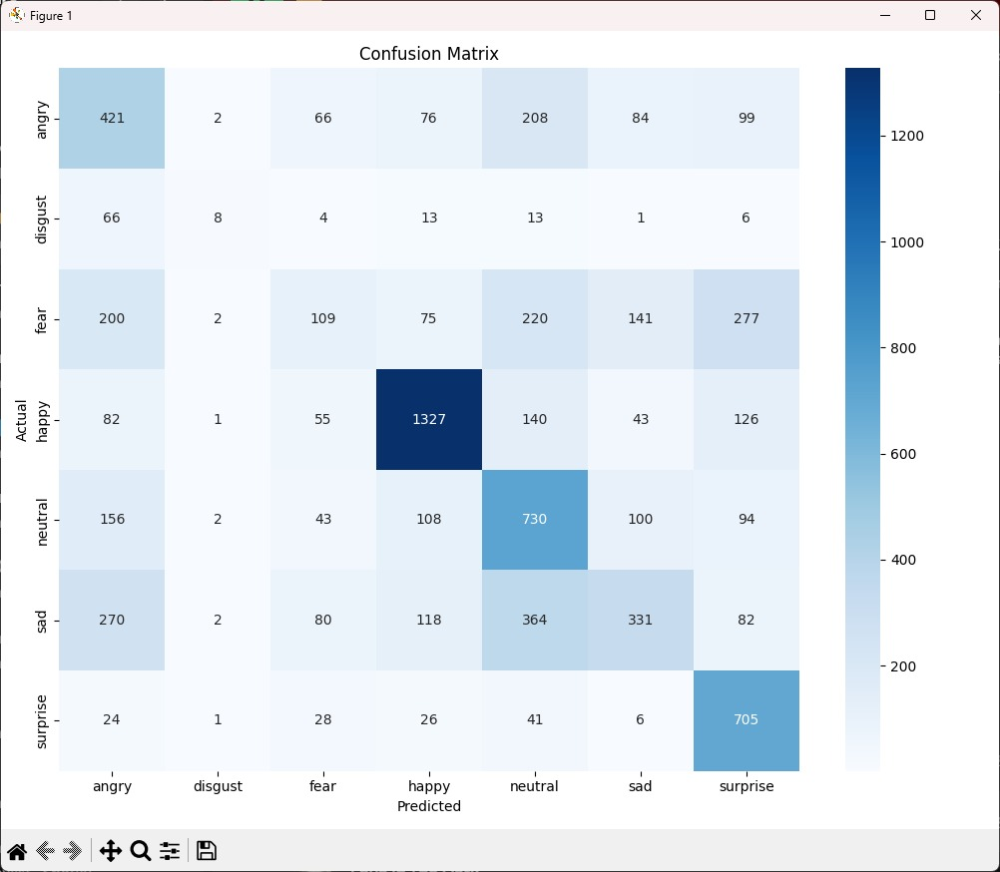
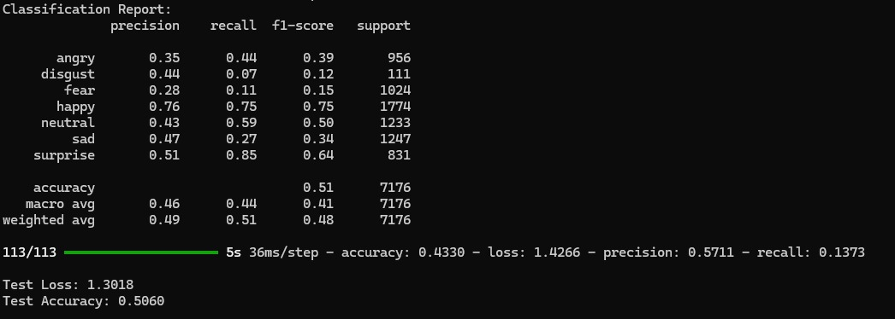

# Emotion Detection using CNN

This project focuses on facial emotion recognition using a Convolutional Neural Network (CNN) trained on grayscale images of size 48x48. It classifies faces into seven different emotions.

## 📁 Dataset Structure

Make sure your dataset is structured as follows:

```
dataset/
├── train/
│   ├── angry/
│   ├── disgust/
│   ├── fear/
│   ├── happy/
│   ├── neutral/
│   ├── sad/
│   └── surprise/
└── test/
    ├── angry/
    ├── disgust/
    ├── fear/
    ├── happy/
    ├── neutral/
    ├── sad/
    └── surprise/
```

Images must be 48x48 pixels in grayscale format.

## 🧠 Model Architecture

- Convolutional layers with increasing filters (32 → 256)
- Batch Normalization after each convolution
- MaxPooling layers after each block
- Dropout layers to prevent overfitting
- Flatten followed by two Dense layers
- Output layer with Softmax for 7 classes

## 🛠️ Techniques Used

- **Data Augmentation:** Rotation, zoom, shift, flip for better generalization
- **Class Weights:** Applied to balance underrepresented classes
- **Callbacks:**
  - EarlyStopping
  - ReduceLROnPlateau
  - ModelCheckpoint

## 🔧 Requirements

Install dependencies using:

```bash
pip install tensorflow matplotlib seaborn scikit-learn
```

## 🚀 Running the Model

### Training

Ensure you're in the correct working directory and run:

```bash
python train_model.py
```

### Output Files

- `emotion_model.h5`: Final saved model
- `best_emotion_model.h5`: Best performing model based on validation loss

## 📊 Evaluation

The script generates:

- Confusion Matrix
- Classification Report (Precision, Recall, F1-score)
- Final test accuracy, precision, and recall

## 📷 Results Visualization

Confusion matrix heatmap(emotion_model.h5):



Classification Report(emotion_model.h5):



---

## 📌 Notes

- Make sure image size and channels match the model input `(48, 48, 1)`.
- Adjust class weights depending on your dataset’s class imbalance.
- You can visualize training curves by extending the `history` object.

---

## 📁 File Structure

```
emotion_project/
├── images/
│   ├── EmoModel_ConfusionMatrix.jpg
│   └── EmoModel_ClassificationReport.jpg
├── models/
│   ├── emotion_model.h5
│   └── best_emotion_model.h5
├── augment_disgust.py
├── evaluate_model.py
├── predict_emotion.py
├── README.md
└── train_model.py
```